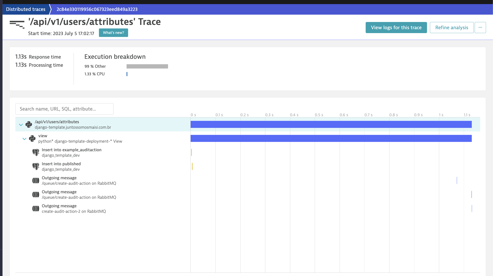
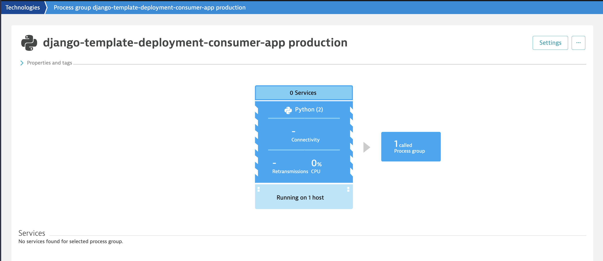

# A simple django app to test dynatrace with oneagent on kubernetes instrumentation

## Configuration services

On the docker-compose file we have three services related with dynatrace instrumentation:
- **app-production**: Django web application (using gunicorn) with code to instrument
- **app-pubsub**: Simple django consumer using [django-stomp](https://github.com/juntossomosmais/django-stomp) library using stomp protocol
- **app-pubsub-pika**: Simple django consumer using [pika](https://pika.readthedocs.io/en/stable/) protocol

Flow: Django + autodynatrace instrumentation > dynatrace sdk > one agent (at the kubernetes) > process and parse > dynatrace ingest api > dynatrace UI

To run the instrumented application with services you can run `docker-compose up app-production`

## How to test ? 

After the up `app-production` you can use the `api/v1/users/attributes` endpoint to test traces. This endpoint will create database item, request to external service, log information, request to redis service and publish a message to rabbit (using pika and stomp protocol).

## Testing using curl
```curl
curl --request POST \
  --url http://127.0.0.1:8080/api/v1/users/attributes \
  --header 'Content-Type: application/json' \
  --data '{
	"full_name": "Carl Edward Sagan",
	"given_name": "Carl",
	"family_name": "Sagan",
	"user_metadata": {
		"city": "santo andré",
		"state": "SP",
		"birthday": "1989-10-10",
		"gender": "male"
	}
}'
```

## Creating local cluster and install one-agent dynatrace

Creates a trial account at [dynatrace](https://www.dynatrace.com/signup/) to generate PAAS token to download one-agent code and install locally.


Creating cluster local and up the django app:
   
    kind create cluster --config ./cluster-and-oneagent-installation/kind-config.yaml 
    kubectl create namespace dynatrace-test
    kubectl config set-context --current --namespace=dynatrace-test

    docker build -t dynatrace-instrumentation-app:latest . --platform linux/amd64
    kind load docker-image dynatrace-instrumentation-app:latest

    kubectl apply -f ./cluster-and-oneagent-installation/k8s-manifests/0-database-and-broker.yaml &&
    kubectl apply -f ./cluster-and-oneagent-installation/k8s-manifests/1-secrets-and-configmap.yaml &&
    kubectl apply -f ./cluster-and-oneagent-installation/k8s-manifests/2-service-and-deployment.yaml

Wait a few minutes, and you should be able to access http://localhost:8080/admin and see django admin

    kubectl get pods
    NAME                                                        READY   STATUS 
    db-postgres-deployment-bd95fc458-dvgqj                      1/1     Running
    django-template-deployment-9c4d6df4b-2mbn7                  1/1     Running
    django-template-deployment-consumer-5b68bc6879-8qf55        1/1     Running
    django-template-pika-deployment-consumer-7b5cb58685-p7hpw   1/1     Running
    rabbit-deployment-5949d576ff-64qn9                          1/1     Running


Installing [dynatrace operator using helm](https://github.com/Dynatrace/dynatrace-operator/tree/main/config/helm/chart/default):
    
    helm repo add dynatrace https://raw.githubusercontent.com/Dynatrace/dynatrace-operator/main/config/helm/repos/stable
    helm install dynatrace-operator dynatrace/dynatrace-operator \
        -f ./cluster-and-oneagent-installation/dynatrace-configuration/values.yaml \
        --atomic \
        --create-namespace --namespace dynatrace \
        --debug

    kubectl apply -f ./cluster-and-oneagent-installation/dynatrace-configuration/dynakube.yaml**


** change the <LIVE_ENVIROMENT_DYNATRACE> and <DYNATRACE_TOKEN> to your dynatrace account

To remove cluster
    
    kind delete cluster

Set the context you had been using before the ride:
    
    kubectl config current-context
    kubectl config get-contexts
    kubectl config use-context YOUR_PREVIOUS_CONTEXT


## Recurring procedures

### Installing new packages and their updates

    docker compose run app poetry update

### Generating a new migration

    docker compose run app python manage.py makemigrations

### To up the project

    docker compose up app-production

### To build image

    docker build -t django-dynatrace-instrumentation:latest . --platform linux/amd64

## Problem with dynatrace instrumentation for consumer

After up the Kubernetes cluster with oneagent, activegate and instrumentated django application we can see the traces for deployment resource. This trace example go to the database, and publish a messages to queue using [pika](https://pypi.org/project/pika/), [django-stomp](https://pypi.org/project/django-stomp/) and [outbox-pattern](https://pypi.org/project/django-outbox-pattern/). We can see all of the publish messages in the traces.





The `dtdTraceTagInfo` is avaiable with valid valid `trace_id` and `span_id` in the header from message. The `trace_id` matches from the publisher log.

Incoming rabbitmq message>
```bash
{"levelname": "INFO", "asctime": "2023-07-05 23:23:37,251", "request_id": "none", "name": "django_template.apps.dynatrace", "message": "autodynatrace - Tracing Incoming RabbitMQ host=<HIDDEN_BROKER_NAME_PROPOSITAL>, port=61614, routing_key=/queue/create-audit-action, tag=FW4;219149364;2;179178852;17;0;45665485;367;36e4;2h01;3h0aae0d64;4h11;6ha01c756b268670daafd428d5aea22f82;7h6d0778c354a0a3ac, headers={'subscription': 'b64e35e5-e868-4e9f-a4b0-3283d9257c5d-listener', 'destination': '/queue/DLQ.create-audit-action', 'message-id': 'T_b64e35e5-e868-4e9f-a4b0-3283d9257c5d-listener@@session-nSFGTrHyy118UUDsAGm5iA@@1', 'redelivered': 'true', 'dtdTraceTagInfo': 'FW4;219149364;2;179178852;17;0;45665485;367;36e4;2h01;3h0aae0d64;4h11;6ha01c756b268670daafd428d5aea22f82;7h6d0778c354a0a3ac', 'tshoot-destination': '/queue/create-audit-action', 'x-dead-letter-exchange': '', 'x-dead-letter-routing-key': 'DLQ.create-audit-action', 'x-first-death-exchange': '', 'x-first-death-queue': 'create-audit-action', 'x-first-death-reason': 'rejected', 'correlation-id': '6b84489a7093561843cd908717b0ad6c', 'persistent': 'true', 'content-type': 'application/json;charset=utf-8', 'content-length': '115'}", "span_id": "0000000000000000", "trace_id": "00000000000000000000000000000000"}
```

But the consumer not have a know a service and don't appear on distributed traces screen




Looking the [log](../docs//log_consumer_example.txt) for deployment we can see the message for correct sdk initialization
```bash
2023-07-05 23:23:35.741 UTC [3553aadf] info    [onesdk] Dynatrace OneAgent SDK for C/C++ initialized successfully.
2023-07-05 23:23:35,743: 7 DEBUG autodynatrace - init: Initialized autodynatrace with AgentState: 1
2023-07-05 23:23:35,743: 7 WARNING autodynatrace - init: Could not initialize the OneAgent SDK, AgentState: 1
```

and in the consumer process
```bash
Agent state (parent process): 1
Agent fork state (parent process): 1
Agent found: True
Agent is compatible: True
Agent version: 1.267.155.20230629-142023/1.7.1
```

Using the `set_diagnostic_callback` and `set_verbose_callback` turned no logs appears for anything.
```python
def turn_on_callback():
    def _diag_callback(unicode_message):
        print("CALLBACK DIAG", unicode_message)

    sdk.set_diagnostic_callback(_diag_callback)
    sdk.set_verbose_callback(_diag_callback)
```
