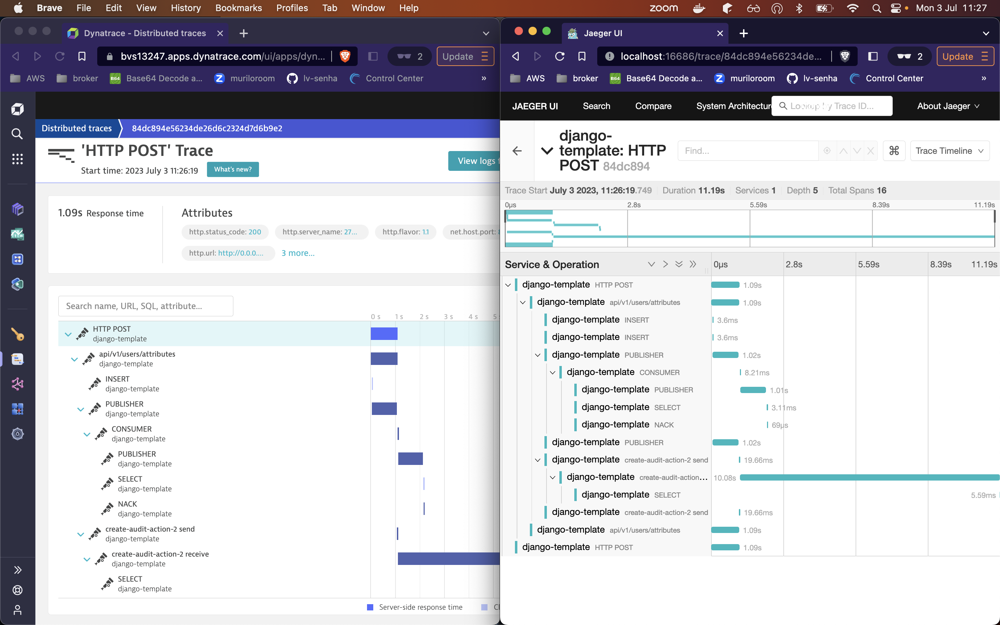

# A simple django app to test opentelemetry instrumentation

## Configuration services

On the docker-compose file we have three services related with opentelemetry:
- **app-telemetry**: Django application with instrument libraries (opentelemetry/tracing.py)
- **otel-collector**: Collector application with responsibility to translate and communicate with apm
- **opentelemetry-jaeger**: APM interface to visualize opentelemetry traces
- **app-pubsub**: Simple django consumer using [django-stomp](https://github.com/juntossomosmais/django-stomp) library using stomp protocol
- **app-pubsub-pika**: Simple django consumer using [pika](https://pika.readthedocs.io/en/stable/) protocol

Flow: Django + instrument libraries > send telemetry data to > otel-collector > process and parse > opentelemetry-jaeger > frontend

To run the instrumented application with services you can run `docker-compose up --build app-telemetry`

In this implementation we use a http exporter in communication with django and collector.

## enviroments

- **OTEL_SERVICE_NAME**: service name to maintain in all telemetry data
- **OTEL_RESOURCE_ATTRIBUTES**: attributes to maintain in all telemetry data
- **OTEL_LOG_LEVEL**: opentelemetry log level
- **OTEL_EXPORTER_OTLP_ENDPOINT**: exporter host endpoint (otel-collector path)
- **OTEL_EXPORTER_OTLP_TRACES_ENDPOINT**: exporter traces host endpoint (otel-collector path)
- **OTEL_PYTHON_DJANGO_INSTRUMENT**: boolean to instrument django application

## How to test ? 

After the up `app-telemetry` you can use the `api/v1/users/attributes` endpoint to test traces. This endpoint will create database item, request to external service, log information, request to redis service and publish a message to rabbit (using pika and stomp protocol).

## Testing using curl
```curl
curl --request POST \
  --url http://0.0.0.0:8080/api/v1/users/attributes \
  --header 'Content-Type: application/json' \
  --data '{
	"full_name": "Carl Edward Sagan",
	"given_name": "Carl",
	"family_name": "Sagan",
	"user_metadata": {
		"city": "santo andré",
		"state": "SP",
		"birthday": "1989-10-10",
		"gender": "male"
	}
}'
```

## Testing instrumented request

This test simulate a instrumented app making request to another instrumented app. 

We need to install opentelemetry libraries from virtualenv and use `OTEL_SERVICE_NAME=service_fake_name python opentelemetry/request_with_trace_headers.py`

step to configure virtualenv - [link](https://github.com/open-telemetry/opentelemetry-python/tree/main/docs/examples/django#preparation)

the `request_with_trace_headers.py` create a fake span to simulate request provided from other service to django app

## How to see traces ? 

Using jaeger interface in `http://localhost:16686/search`




or

docker terminal log
```shell
app-telemetry_1         | {
app-telemetry_1         |     "name": "api/v1/users/attributes",
app-telemetry_1         |     "context": {
app-telemetry_1         |         "trace_id": "0xb0108bee108149bbe1c0d1341021012c",
app-telemetry_1         |         "span_id": "0xcfb7a30cfb46782f",
app-telemetry_1         |         "trace_state": "[]"
app-telemetry_1         |     },
app-telemetry_1         |     "kind": "SpanKind.SERVER",
app-telemetry_1         |     "parent_id": null,
app-telemetry_1         |     "start_time": "2022-10-26T17:41:26.955504Z",
app-telemetry_1         |     "end_time": "2022-10-26T17:41:28.009913Z",
app-telemetry_1         |     "status": {
app-telemetry_1         |         "status_code": "UNSET"
app-telemetry_1         |     },
app-telemetry_1         |     "attributes": {
app-telemetry_1         |         "http.method": "POST",
app-telemetry_1         |         "http.server_name": "cd8b65fba816",
app-telemetry_1         |         "http.scheme": "http",
app-telemetry_1         |         "net.host.port": 8080,
app-telemetry_1         |         "http.host": "0.0.0.0:8080",
app-telemetry_1         |         "http.url": "http://0.0.0.0:8080/api/v1/users/attributes",
app-telemetry_1         |         "net.peer.ip": "192.168.112.1",
app-telemetry_1         |         "http.user_agent": "insomnia/2022.5.1",
app-telemetry_1         |         "http.flavor": "1.1",
app-telemetry_1         |         "http.route": "api/v1/users/attributes",
app-telemetry_1         |         "http.status_code": 200
app-telemetry_1         |     },
app-telemetry_1         |     "events": [],
app-telemetry_1         |     "links": [],
app-telemetry_1         |     "resource": {
app-telemetry_1         |         "attributes": {
app-telemetry_1         |             "telemetry.sdk.language": "python",
app-telemetry_1         |             "telemetry.sdk.name": "opentelemetry",
app-telemetry_1         |             "telemetry.sdk.version": "1.13.0",
app-telemetry_1         |             "service.name": "giza-necropolis"
app-telemetry_1         |         },
app-telemetry_1         |         "schema_url": ""
app-telemetry_1         |     }
app-telemetry_1         | }
```

## Recurring procedures

### Installing new packages and their updates

    docker compose run app poetry update

### Generating a new migration

    docker compose run app python manage.py makemigrations

### To up the project with opentelemetry instrumentation

    docker compose up app-telemetry

### To up consumer to read messages

- using pika: docker compose up pubsub-pika
- using django-stomp: docker compose up pubsub

### To use dynatrace integration for local traces

Creates a trial account at [dynatrace](https://www.dynatrace.com/signup/) and in the file `collector-config.yaml` you can change the `otlphttp`, `dynatrace` endpoint and token to your dynatrace live.

```yaml
  otlphttp:
    endpoint: https://{YOU LIVE HERE}.live.dynatrace.com/api/v2/otlp
    headers:
      authorization: "Api-Token {YOUR TOKEN}"

  dynatrace:
    endpoint: https://{YOU LIVE HERE}.live.dynatrace.com
    api_token: "{YOUR TOKEN}"
    resource_to_telemetry_conversion:
      enabled: true
```

To generate token with ingest permission you can run this curl below:
```bash
curl -X POST "https://{YOU LIVE HERE}.live.dynatrace.com/api/v2/apiTokens" -H "accept: application/json; charset=utf-8" -H "Content-Type: application/json; charset=utf-8" -d "{\"name\":\"Opentelemetry\",\"scopes\":[\"logs.ingest\",\"metrics.ingest\",\"openTelemetryTrace.ingest\"]}" -H "Authorization: Api-Token "{YOUR PERSONAL TOKEN}""
```